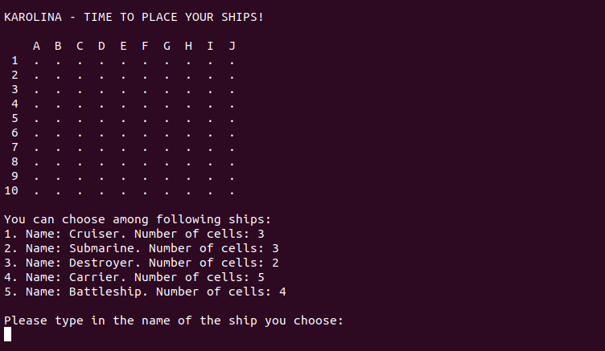
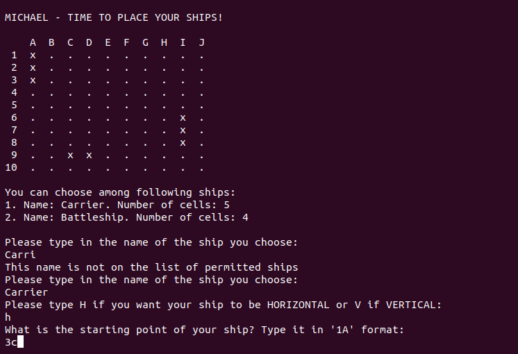
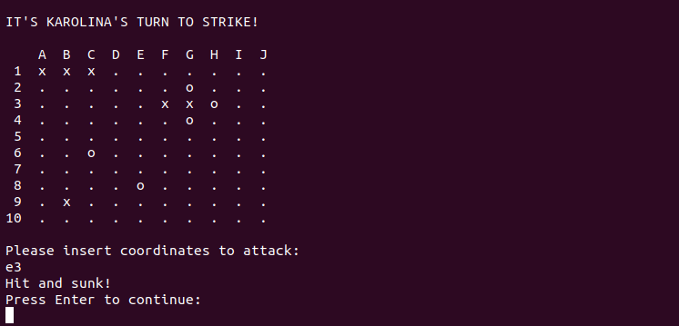
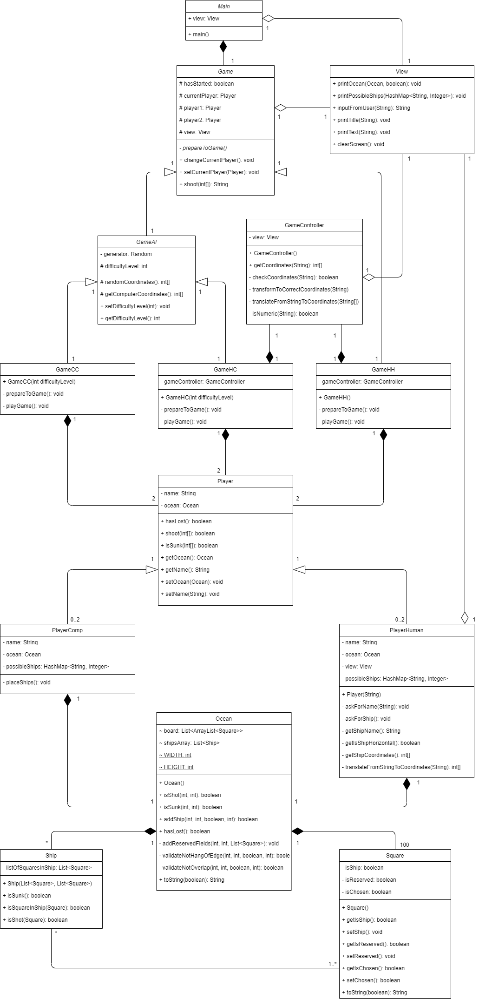

# Java exercise 3 - Battleships

2-weeks pair assignment aiming at creating Battleships game with focus on Java classes and their inharitance. During 2-days extra workshops the basic version of playing with computer was added.

## General info
The game has 3 basic modes: human vs. human, human vs. computer and computer vs computer.

In human mode the game preparation mode is enabled. Program asks each player for name and for placing ships on their map.

The process of adding ships is fully validated, both in terms of proper input as well as placing ships on allowed squares.

When ships are placed, the actual games starts. Players take turns on shooting to each other's ships. Players are informed if they hit or missed the ship.

Game also have modes to play with computer. They are available to play. However, only the easiest computer mode is enabled, which means that computer shoots ships fully randomly. Other modes might be added in the future.

## UML class diagram
This assignment aimed at planning project in terms of using proper (logical and scalable) classes and methods. Therefore, the UML class diagram has been created and modified while working on the project

## Technologies
* Java SE 13

## Lessons learned from the assignment
* Using abstract classes, method inheritance and protected variable scope
* Carefully planning class usage and work division in group

## Status
Project is finished, with potential to be developed further in the future.

## Credits
Project assigned and supervised by Codecool mentors.

## Technical specification:

### __[main](specifications/main.md)__

### __[square](specifications/square.md)__

### __[ship](specifications/ship.md)__

### __[ocean](specifications/ocean.md)__

### __[game](specifications/game.md)__

### __[player](specifications/player.md)__

### __[view](specifications/view.md)__